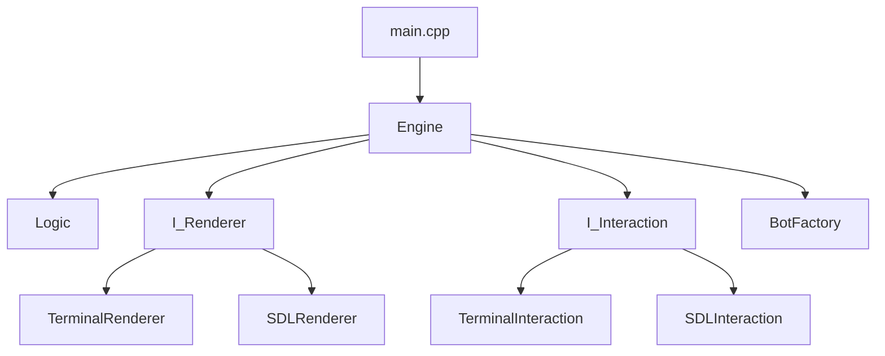
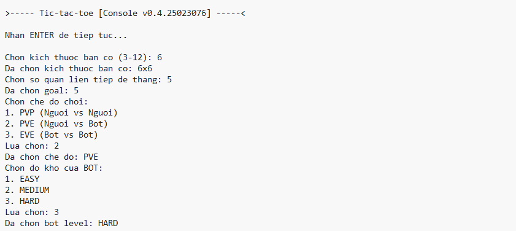
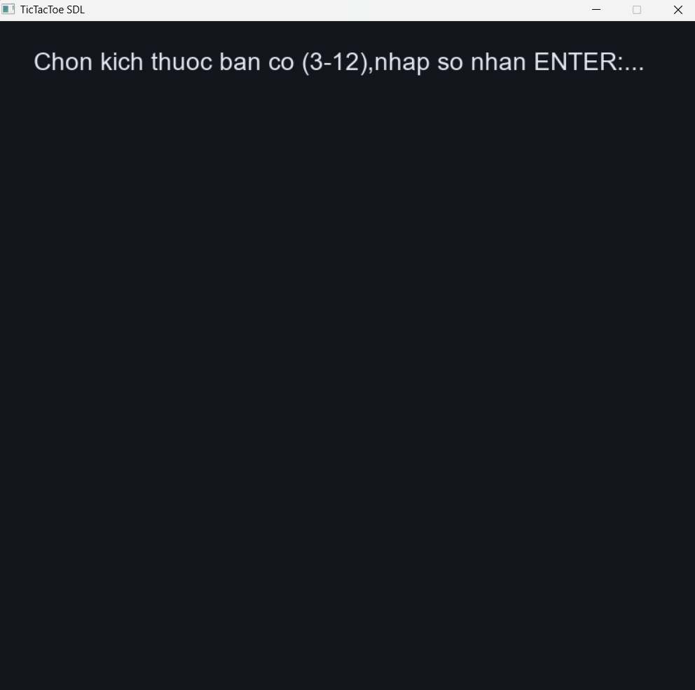
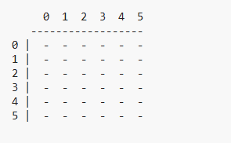
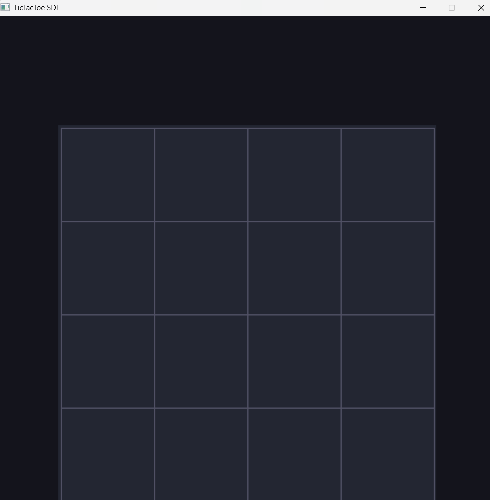
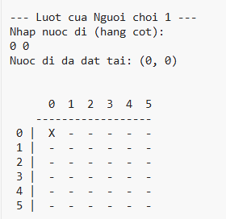
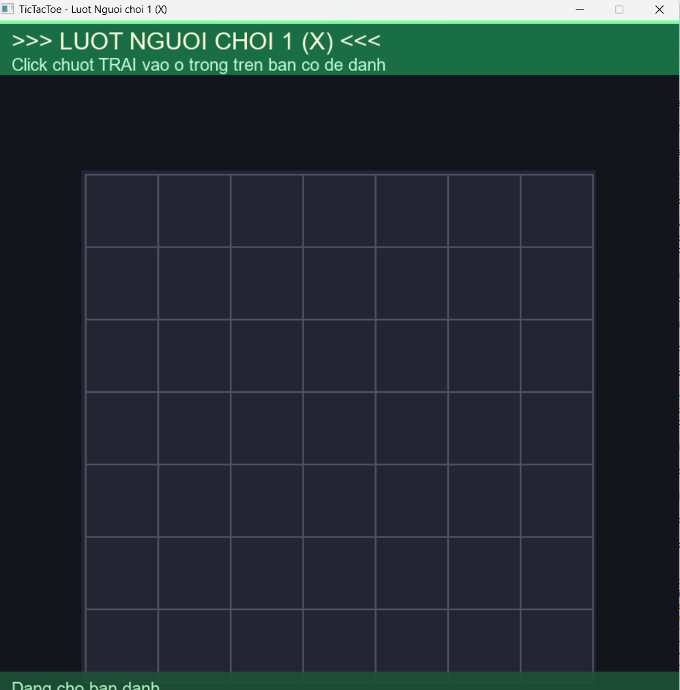
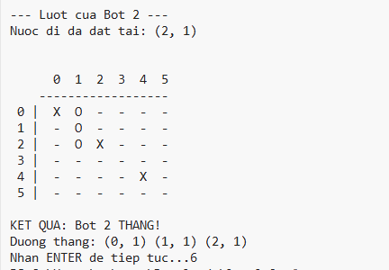
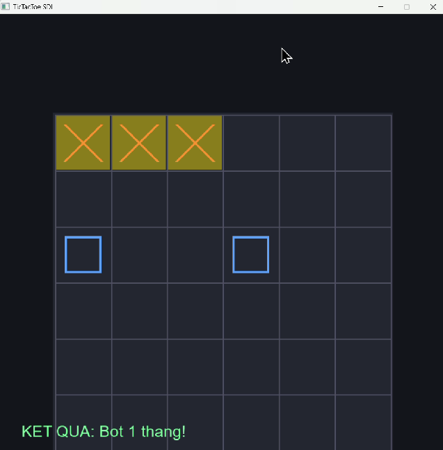
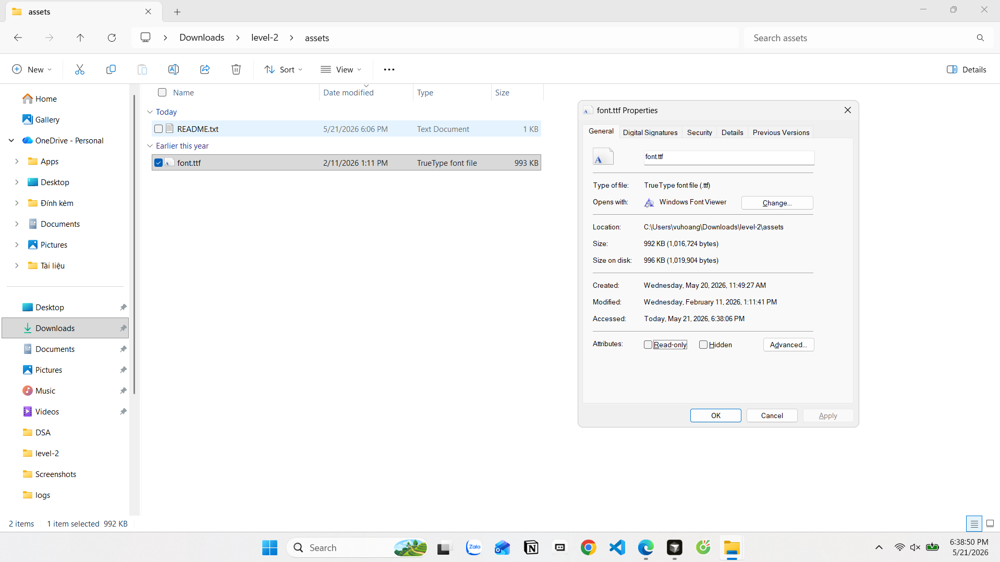

# BÁO CÁO BÀI TẬP LỚN — LEVEL 2

**Môn:** Phương pháp luận lập trình (2526II.UET.AI2013)  
**Đề tài:** Tic-Tac-Toe mở rộng — Lập trình hướng đối tượng (Object-Oriented Programming) và giao diện đồ họa (Graphical User Interface, GUI)  
**Phiên bản chương trình:** 0.4.25023076


---

## 1. Tổng quan (Overview)

### 1.1. Thông tin cá nhân


|                |                  |
| -------------- | ---------------- |
| **Họ và tên**  | Hoàng Tấn Anh Vũ |
| **MSSV**       | 25023076         |
| **Lớp / Khóa** | K70A-AI4         |


### 1.2. Tổng quan thiết kế luồng thực thi

Chương trình được tổ chức theo kiến trúc **Engine-centric**: lớp `Engine` điều phối toàn bộ vòng đời trò chơi, làm việc với hai giao diện trừu tượng `I_Renderer` (hiển thị) và `I_Interaction` (nhập liệu), cùng module `Logic` (luật chơi) và hệ thống `Bot` (máy).

**Luồng tuần tự chính** (giữ tư duy Level 1, phù hợp starter code):

```
main() → parseArgs() → Logger::init()
      → khởi tạo Terminal* hoặc SDL* (đa hình)
      → Engine::init() → startGame() → playGame() → endGame() → close()
```

- **init():** Khởi tạo renderer và interaction theo `RunConfig`.
- **startGame():** Thu thập cấu hình (kích thước bàn, goal, chế độ, level bot), khởi tạo bàn cờ.
- **playGame():** Vòng lặp lượt — render → nhận nước đi (người hoặc bot) → `Logic::makeMove` → kiểm tra thắng/hòa → đổi lượt.
- **endGame():** Hiển thị kết quả; chế độ judge in `winner turns` ra stdout.
- **close():** Giải phóng tài nguyên SDL/terminal.

**Lý do giữ luồng tuần tự:** Dễ đồng bộ với Terminal (`cin`/`cout`), dễ kiểm thử bằng `grader.py` (`-j -i`), và Engine không phụ thuộc chi tiết SDL. Với GUI, mỗi hàm `I_Interaction` **chờ blocking** trên SDL event (phím số + Enter cho menu, chuột cho nước đi), còn `I_Renderer` vẽ và `SDL_RenderPresent` — vừa đủ event-driven trong phạm vi interface, chưa refactor sang state machine toàn cục.

**Ưu điểm:** Tách rõ trách nhiệm; thay Terminal/SDL mà không sửa Engine.  
**Nhược điểm:** SDL setup vẫn “bước–bước” như CLI; khó mở rộng animation phức tạp hoặc menu đồng thời nhiều vùng nếu không chuyển sang game loop theo trạng thái (state-based loop).




### 1.3. Giao diện đồ họa (GUI) — hiển thị và tương tác


| Hạng mục                 | Lựa chọn trong bài làm                                                                                                                                                                               |
| ------------------------ | ---------------------------------------------------------------------------------------------------------------------------------------------------------------------------------------------------- |
| **Thư viện**             | SDL2 + SDL2_ttf                                                                                                                                                                                      |
| **Hiển thị**             | Vẽ hình học (grid, ô, ký hiệu X/O bằng `SDL_RenderDrawLine` / `SDL_RenderDrawRect`); chữ menu/trạng thái bằng **SDL_ttf** (font TrueType)                                                            |
| **Sprite / texture ảnh** | Không dùng sprite sheet; ưu tiên primitive + TTF để giảm phụ thuộc assets                                                                                                                            |
| **Font**                 | `assets/font.ttf` (Arial, TrueType). **Fallback:** thử lần lượt `assets/DejaVuSans.ttf`, `C:/Windows/Fonts/arial.ttf`, `C:/Windows/Fonts/segoeui.ttf` trong `FONT_PATHS[]` (`src/sdl/renderer.cpp`). |
| **Kích thước font**      | 20px (nội dung), 28px (tiêu đề)                                                                                                                                                                      |
| **Tương tác setup**      | Bàn phím: nhập chữ số, **Enter** xác nhận                                                                                                                                                            |
| **Tương tác chơi**       | Chuột trái: click ô trên bàn cờ (`pixelToCell` trong `board_layout.h`); thanh trạng thái lượt người (`drawTurnStatusBar`, `drawHumanTurnHint`) và đổi tiêu đề cửa sổ (`SDL_SetWindowTitle`)          |
| **Tương tác khác**       | Đóng cửa sổ → `QuitException`; pause: phím hoặc click (SDL), Enter (Terminal)                                                                                                                        |
| **Tay cầm**              | Chưa hỗ trợ                                                                                                                                                                                          |


Chế độ chạy: `./game.exe` (Terminal), `./game.exe -g` (SDL), `./game.exe -j -i <file>` (judge, luôn Terminal).

---

## 2. Chi tiết cài đặt (Implementation Details)

### 2.1. Tư duy thiết kế và luồng Engine

**Phân tầng:**


| Tầng           | Vai trò                         | File tiêu biểu                |
| -------------- | ------------------------------- | ----------------------------- |
| Entry          | Parse flag, chọn implementation | `src/main.cpp`                |
| Engine         | Điều phối vòng đời              | `src/game/engine.cpp`         |
| Logic          | Luật chơi thuần                 | `src/game/logic.cpp`          |
| Interface      | Hợp đồng UI                     | `src/game/interface/i_*.h`    |
| Terminal / SDL | Cài đặt cụ thể                  | `src/terminal/`*, `src/sdl/`* |
| Bot            | AI + Factory                    | `src/game/bot/*`              |
| Utils          | Logger, config, helper          | `src/utils/*`                 |


**Thay đổi so với starter:** Hoàn thiện toàn bộ hàm `throw NotImplementedException()`; bổ sung `Logic::getWinLine` để highlight đường thắng; thêm `board_layout.h` cho SDL; không đổi chữ ký public của Engine.

**Dependency Injection (nạp phụ thuộc):** `Engine` nhận `RunConfig`*, `I_Renderer`*, `I_Interaction*` qua constructor — Engine không `new` Terminal/SDL trực tiếp (tuân thủ hướng **Dependency Inversion**).

### 2.2. Trả lời câu hỏi trọng tâm

#### Câu 1 — Bốn nguyên lý OOP


| Nguyên lý                    | Có đạt? | Minh chứng trong mã nguồn                                                                                                                                                                   |
| ---------------------------- | ------- | ------------------------------------------------------------------------------------------------------------------------------------------------------------------------------------------- |
| **Đóng gói (Encapsulation)** | Có      | `Engine` giữ `gameSetup`, con trỏ renderer/interaction ở `private`; `SDLRenderer` che `window`, `renderer`, `font`; chỉ expose hàm `public` cần thiết                                       |
| **Kế thừa (Inheritance)**    | Có      | `TerminalRenderer : I_Renderer`, `SDLRenderer : I_Renderer`; `BotLevel1` → `BotLevel2` → `BotLevel3` kế thừa `Bot`                                                                          |
| **Trừu tượng (Abstraction)** | Có      | `I_Renderer`, `I_Interaction`, `Bot::getMove` pure virtual; Engine chỉ gọi interface, không biết Terminal hay SDL                                                                           |
| **Đa hình (Polymorphism)**   | Có      | `main.cpp`: `I_Renderer* iRenderer = new TerminalRenderer()` hoặc `new SDLRenderer()`; `BotFactory::createBot` trả `Bot`* trỏ tới lớp con; `engine->playGame()` gọi `bots[player]->getMove` |


**Bổ sung so với starter:** Triển khai đầy đủ lớp con; `getWinLine`; layout SDL tách file; bot dùng `std::mt19937` (seed cố định) thay `rand()`.

#### Câu 2 — Cân bằng Terminal và GUI

**Đánh giá: Có cân bằng ở mức hợp đồng (interface), chưa đồng đều về trải nghiệm.**

**Cốt lõi giúp hài hòa:**

1. **I_Renderer / I_Interaction** — cùng bộ method (`showSelectMenu`, `displayBoard`, `selectSize`, `getPlayerMove`, …).
2. **Engine một luồng** — không nhánh `if (gui)` rải rác trong `playGame`.
3. **RunConfig** — `-g` đổi implementation tại `main`; `-j` ép Terminal + file input.

**Khó khăn:**

- Terminal: đồng bộ `cin`; SDL: event blocking — cùng API nhưng mô hình thời gian khác.
- Setup SDL dùng phím số (giống CLI) thay UI graphical hoàn toàn — đơn giản hóa nhưng kém “GUI thuần”.
- Layout click (`board_layout.h`) phải đồng bộ `boardSize` giữa `SDLInteraction` và `SDLRenderer`.

#### Câu 3 — Tuân thủ SOLID


| Nguyên tắc                    | Mức độ         | Minh chứng                                                                 | Vi phạm / hạn chế                                                                                         |
| ----------------------------- | -------------- | -------------------------------------------------------------------------- | --------------------------------------------------------------------------------------------------------- |
| **S** — Single Responsibility | Khá tốt        | `Logic` chỉ luật; `Logger` chỉ log; Renderer chỉ vẽ; Interaction chỉ input | `Engine` vừa setup vừa game loop (chấp nhận được ở quy mô bài tập)                                        |
| **O** — Open/Closed           | Khá tốt        | Thêm bot mới: class + nhánh Factory, không sửa `playGame`                  | Thêm loại UI mới vẫn phải sửa `main.cpp`                                                                  |
| **L** — Liskov Substitution   | Tốt            | `TerminalRenderer` / `SDLRenderer` thay thế được qua `I_Renderer`*         | —                                                                                                         |
| **I** — Interface Segregation | Chấp nhận được | Hai interface gọn cho game này                                             | Client buộc implement toàn bộ method dù SDL/Terminal không dùng hết (ví dụ `printResult` trên SDL vẫn có) |
| **D** — Dependency Inversion  | Tốt            | Engine phụ thuộc `I`_*; `main` inject implementation                       | `main` vẫn `new` concrete class (chưa dùng DI container)                                                  |


#### Câu 4 — Mẫu thiết kế (Design Pattern)


| Mẫu                             | Vai trò                                | Minh chứng                                      |
| ------------------------------- | -------------------------------------- | ----------------------------------------------- |
| **Factory Method**              | Tạo bot theo `BotLevel`                | `BotFactory::createBot` → `new BotLevel1/2/3`   |
| **Strategy** (gần nghĩa)        | Đổi thuật toán bot / đổi UI            | `getMove` override; Terminal vs SDL             |
| **Template Method** (gần nghĩa) | Khung Engine cố định, bước con đa hình | `startGame` / `playGame` gọi virtual trên `I_`* |


Không dùng Singleton cho Logger (namespace static methods — đơn giản cho bài tập).

### 2.3. Giao diện đồ họa — Hiển thị (Rendering)

**Triết lý:** Ưu tiên **primitive rendering** (ổn định, ít asset), TTF chỉ cho text hướng dẫn; X/O vẽ bằng line/rect để không phụ thuộc file ảnh.

**Pipeline:**

1. `SDLRenderer::init` — `SDL_CreateWindow`, `SDL_CreateRenderer`, `TTF_OpenFont`.
2. `computeBoardLayout(config, size)` — `cellSize`, `originX/Y`.
3. `clearScreen` → vẽ nền → `drawBoardGrid` → `drawSymbolAt` cho từng ô.
4. `highlightCell` cho nước đi mới / đường thắng (`WinLine`).
5. `renderPresent` — đẩy frame.

#### Đánh giá và Phân tích hiệu năng hệ thống

- **Cơ chế làm tươi (Redraw Pipeline):** Chương trình áp dụng phương pháp dựng hình tuần tự: Mỗi lượt đi sẽ xóa màn hình và vẽ lại toàn bộ lưới cùng các quân cờ. Vì quy mô bàn cờ Caro nhỏ, việc vẽ lại toàn bộ không gây áp lực lên phần cứng. Cấu trúc chương trình hoạt động cực kỳ ổn định mà chưa cần tối ưu bằng các kỹ thuật phức tạp như *Dirty Rect* (chỉ vẽ lại vùng có sự thay đổi).
- **Mô hình quản lý tài nguyên và FPS:** Do chương trình sử dụng mô hình tuần tự chặn sự kiện (`SDL_WaitEvent`) thay vì vòng lặp game vô hạn vô điều kiện (*Uncapped Game Loop*), màn hình chỉ thực hiện vẽ lại khi có sự kiện chuột hoặc phím xảy ra. Ở trạng thái tĩnh, tài nguyên CPU tiêu thụ gần như bằng **0%**. Khi chạy hiệu ứng mạch đập (*Pulse Animation*) ở hàm `showMove`, thời gian dựng một frame hình cực kỳ nhanh, đạt độ mượt mà tiêu chuẩn **60 FPS** (tương đương ~16.6 ms/frame).
- **Tách biệt luồng xử lý và thời gian tính toán AI:** Nhờ việc cấu hình cờ `-v` kết hợp bộ đo thời gian `measureExecutionTime` cho hàm `bots[player]->getMove()`, thời gian tính toán logic của AI được cô lập hoàn toàn với thời gian render đồ họa. Qua số liệu thực tế tại nhật ký hệ thống (`DEBUG`), thời gian tính toán nước đi của Bot ở mức Medium/Hard chỉ dao động trung bình từ **0.00012s đến 0.00050s**, chứng tỏ thuật toán chạy cực kỳ tối ưu trên CPU và không gây hiện tượng giật lag.

### 2.4. Giao diện đồ họa — Tương tác (Interaction)


| Giai đoạn                    | Cơ chế SDL                                                                                                                                                                                                                       |
| ---------------------------- | -------------------------------------------------------------------------------------------------------------------------------------------------------------------------------------------------------------------------------- |
| Menu (size, goal, mode, bot) | Lắng nghe sự kiện `SDL_KEYDOWN` bắt các phím số từ `SDLK_0` đến `SDLK_9` (và vùng Numpad) -> Đẩy ký tự vào chuỗi `buffer` -> Nhấn phím `SDLK_RETURN` (Enter) để chốt dữ liệu và kích hoạt hàm kiểm tra tính hợp lệ (`validate`). |
| Nước đi                      | Bắt sự kiện click chuột trái `SDL_MOUSEBUTTONDOWN` với `event.button.button == SDL_BUTTON_LEFT`.                                                                                                                                 |
| Thoát                        | Nhận diện sự kiện `SDL_QUIT` (bấm nút X cửa sổ) -> Ném ra ngoại lệ `QuitException()` để giải phóng bộ nhớ và thoát an toàn.                                                                                                      |
| Pause                        | Sử dụng vòng lặp kiểm tra sự kiện, mở khóa khi nhận `SDL_KEYDOWN` hoặc `SDL_MOUSEBUTTONDOWN`.                                                                                                                                    |


- **Khó khăn lớn nhất trong quá trình cài đặt:**
  1. **Xung đột sự kiện nhập liệu:** Ban đầu, hệ thống sử dụng song song cả `SDL_KEYDOWN` và `SDL_TEXTINPUT` dẫn đến lỗi xung đột kép: khi người dùng gõ một phím số, cả hai sự kiện đều bắt được ký tự đó và đẩy vào `buffer`, khiến giá trị bị nhân đôi (ví dụ gõ phím số `3` thì buffer ghi nhận thành `"33"`), dẫn đến lỗi "Nhập không hợp lệ".
  2. **Mất đồng bộ hiển thị khi đợi Input:** Ở chế độ PvE, luồng tuần tự của Engine gọi hàm hiển thị thông báo chọn ô trước, làm xóa mất hình ảnh lưới bàn cờ cũ ngay trước khi hàm `getPlayerMove` đi vào vòng lặp chặn `SDL_WaitEvent`, tạo ra hiện tượng bàn cờ bị biến mất khi đến lượt người chơi.
- **Giải pháp xử lý dứt điểm:**
  1. Loại bỏ hoàn toàn luồng xử lý sự kiện `SDL_TEXTINPUT` trong hàm `readNumericInput`, chỉ dùng `SDL_KEYDOWN` (phím số hàng trên và Numpad) để tránh nhân đôi ký tự trong `buffer`.
  2. Trong `src/game/engine.cpp`, vòng lặp `do-while` lấy nước đi người gọi `displayBoard` ngay trước `getPlayerMove`, đảm bảo lưới cờ luôn hiển thị khi chờ click chuột.
  3. Trên `SDLRenderer`: `showPlayer` và `showSelectMenu(PLAYER_UI)` vẽ lại bàn cờ kèm `drawTurnStatusBar` (thanh xanh *"LUOT NGUOI CHOI"*) và `drawHumanTurnHint`; `SDL_SetWindowTitle` đổi tiêu đề cửa sổ theo lượt. Chưa triển khai highlight theo di chuyển chuột (`SDL_MOUSEMOTION`).
  4. Khi nhập số trong SDL setup, `readNumericInput` vẫn echo từng phím ra **console** (DevTool) để theo dõi — giao diện chính vẫn là cửa sổ SDL.

---

## 3. Kết quả thực nghiệm (Experiment Results)

> **Lưu ý:** Chèn ảnh và log **thực tế** từ máy bạn. Tên file gợi ý theo mục V.6 PDF, đặt trong thư mục `results/` và `logs/`.

### 3.1. Ảnh chụp màn hình — Terminal vs Graphic

Đặt ảnh theo cặp để so sánh cùng màn hình logic:

#### Menu / tiêu đề

| Terminal | SDL (GUI) |
| ------------- | --------- |
|  |  |

*Hình 1 — Menu khởi động / chọn tham số.*

**Nhận xét:** Giao diện Terminal hiển thị các tùy chọn menu dưới dạng dòng lệnh (*Text-based*) tuần tự, mang tính tối giản và tối ưu hóa tốc độ xử lý khi kiểm thử. Trong khi đó, giao diện đồ họa SDL (GUI) cung cấp các bảng panel hiển thị trực quan thông qua phông chữ TrueType (`SDL2_ttf`), kết hợp với các chỉ dẫn phím bấm rõ ràng giúp tăng trải nghiệm người dùng. Mặc dù hình thức hiển thị và cách thức bắt sự kiện phím có sự khác biệt lớn về mặt hạ tầng, cả hai thực tế đều được điều phối bởi cùng một luồng `startGame()` duy nhất từ lớp `Engine`. Điều này minh chứng cho tính hiệu quả của việc thiết kế hướng cấu trúc và che giấu chi tiết cài đặt của các lớp giao diện cụ thể.

---

#### Bàn cờ đang chơi

| Terminal | SDL |
| -------------- | --------- |
|  |  |

*Hình 2 — Hiển thị bàn cờ.*

**Nhận xét:** Trên Terminal, bàn cờ được vẽ thô sơ bằng cách lặp mảng và in ra các ký tự ngăn cách như `|`, `-`, quân cờ được định danh rõ bằng chữ `X` hoặc `O` hoa kết hợp thanh chỉ mục hàng/cột rõ ràng. Trên GUI của SDL2, bàn cờ được dựng tinh xảo hơn qua các đường nét mảnh hình học, các quân cờ được tô màu sắc tương phản rõ rệt để tăng khả năng nhận diện, kèm theo tính năng Highlight làm nổi bật ô cờ vừa được đánh. Bản chất dữ liệu truyền xuống cho cả hai bộ render đều lấy từ chung một mảng hai chiều `gameSetup.board` từ lớp Logic, chứng tỏ tính độc lập hoàn hảo giữa phần xử lý tính toán và phần hiển thị hình ảnh.

---

#### Nước đi người chơi

| Terminal | SDL |
| -------------------- | --------------- |
|  |  |

*Hình 3 — Nước đi người.*

**Nhận xét:** Trên Terminal, người chơi nhập cặp tọa độ `row col` qua `cin` sau dòng nhắc *"Nhap nuoc di (hang cot)"*. Trên SDL, người chơi click chuột trái lên ô cờ; màn hình hiển thị thanh trạng thái *"LUOT NGUOI CHOI"* và hướng dẫn click trước khi `getPlayerMove` chặn chờ sự kiện. Sau khi đánh, `showMove` highlight ô vừa chọn (pulse animation ngắn).

---

#### Kết quả trận đấu

| Terminal | SDL |
| --------------- | ---------- |
|  |  |

*Hình 4 — Màn hình kết quả .*

**Nhận xét tổng:** Hai giao diện cùng implement `I_Renderer`/`I_Interaction` nên luồng game giống nhau; khác biệt chủ yếu ở trải nghiệm trực quan và kiểu input.

### 3.2. Tài nguyên game (Assets)


| Tài nguyên            | Chi tiết                                                       |
| --------------------- | -------------------------------------------------------------- |
| **Font**              | File: `assets/font.ttf` (TrueType). Arial                      |
| **Kích thước**        | 20 pt (thường), 28 pt (tiêu đề) qua `TTF_OpenFont(path, size)` |
| **Nguồn**             | Microsoft Arial — System font                                  |
| **Sprite / âm thanh** | Không sử dụng trong bản nộp                                    |


#### Pipeline: Assets → Render → Màn hình


| Bước | Minh chứng |
| :---: | :---: |
| (1) File font gốc |  |
| (2) Frame SDL (render) |  |
| (3) Màn hình cuối |  |

*Hình 5 — Pipeline tài nguyên đồ họa và font.*

**Mô tả load font trong code:**

```cpp
// src/sdl/renderer.cpp — mảng FONT_PATHS[], openFirstFont()
const char* FONT_PATHS[] = {
    "assets/font.ttf",
    "assets/DejaVuSans.ttf",
    "C:/Windows/Fonts/arial.ttf",
    "C:/Windows/Fonts/segoeui.ttf",
};
TTF_OpenFont(path, 20);  // nội dung; 28 cho fontLarge (tiêu đề)
```

### 3.3. Trích dẫn Log

Logger tách **UI** (cout / SDL) và **DevTool** (`log.txt` hoặc console với `-v -l`).

#### Đoạn 1 — Khởi tạo Engine và hạ tầng

```text
[INFO] - [2026-05-21 17:22:19] Terminal Renderer initialized!
[INFO] - [2026-05-21 17:22:19] Terminal Interaction initialized!
[INFO] - [2026-05-21 17:22:19] Infra initialized!
[INFO] - [2026-05-21 17:22:19] Engine initializing . . .
[INFO] - [2026-05-21 17:22:19] Engine initialized!
```

*→ Thể hiện: chọn implementation, init renderer/interaction trước `startGame`.*

#### Đoạn 2 — Luồng `startGame` / input người dùng

```text
[INFO] - [2026-05-21 17:22:19] [Engine] Starting game . . .
[DEBUG] - [2026-05-21 17:22:23] user input 'size' = 7
[DEBUG] - [2026-05-21 17:22:24] user input 'goal' = 4
[DEBUG] - [2026-05-21 17:22:25] user input 'game mode' = EVE
[DEBUG] - [2026-05-21 17:22:26] user input 'bot level[0]' = HARD
[DEBUG] - [2026-05-21 17:22:27] user input 'bot level[1]' = HARD
[INFO] - [2026-05-21 17:22:27] Board initialized!
[INFO] - [2026-05-21 17:22:27] [Engine] Game started!
```

#### Đoạn 3 — Vòng lặp `playGame` (lượt, bot)

```text
[DEBUG] - [2026-05-21 17:22:27] [Engine] starting turn #0
[DEBUG] - [2026-05-21 17:22:27] execution time of [bot#0->getMove()] = 2.82e-05s
[DEBUG] - [2026-05-21 17:22:27] player 1 make move to (0, 0)
[DEBUG] - [2026-05-21 17:22:28] [Engine] turn done!
[DEBUG] - [2026-05-21 17:22:28] [Engine] starting turn #1
[DEBUG] - [2026-05-21 17:22:28] execution time of [bot#1->getMove()] = 3.6e-05s
[DEBUG] - [2026-05-21 17:22:28] player 2 make move to (0, 1)
[DEBUG] - [2026-05-21 17:22:30] [Engine] turn done!
[DEBUG] - [2026-05-21 17:22:30] [Engine] starting turn #2
[DEBUG] - [2026-05-21 17:22:30] execution time of [bot#0->getMove()] = 5.13e-05s
...
[DEBUG] - [2026-05-21 17:23:09] player 1 make move to (5, 2)
[DEBUG] - [2026-05-21 17:23:11] [Engine] turn done!
[INFO] - [2026-05-21 17:23:11] [Engine] Game done!
[INFO] - [2026-05-21 17:23:11] [Engine] Ending game . . .
[DEBUG] - [2026-05-21 17:23:11] [WinLine] cells: (3, 4) (4, 3) (5, 2) (6, 1) 

```

#### Đoạn 4 — SDL (khi `-g -v`)

```text
[INFO] - [2026-05-20 22:44:28] SDL Renderer initialized!
[INFO] - [2026-05-20 22:44:28] SDL Interaction initialized!
[INFO] - [2026-05-20 22:44:28] Infra initialized!
[INFO] - [2026-05-20 22:44:28] Engine initializing . . .
[DEBUG] - [2026-05-20 22:44:28] SDL font loaded: assets/font.ttf
[DEBUG] - [2026-05-20 22:44:28] SDL font loaded: assets/font.ttf
```

**So sánh UI vs Logger:** Người chơi thấy bàn cờ / menu trên terminal hoặc cửa sổ SDL; thông tin DEBUG (turn, tọa độ, thời gian bot) chỉ trong log — đúng mục đích DevTool theo đề bài.

### 3.4. Kiểm thử chức năng


| Kiểm tra | Lệnh                                                     | Kết quả mong đợi                    |
| -------- | -------------------------------------------------------- | ----------------------------------- |
| Judge    | `game.exe -j -i testcase/input1.txt`                     | stdout: `-1 9` (khớp `output1.txt`) |
| Grader   | `python grader.py --target game --testcase_dir testcase` | Pass các testcase                   |
| GUI      | `game.exe -g`                                            | Cửa sổ SDL, chơi được               |


*Đã pass 5/5 testcase ngày 21/5 trên máy tính cá nhân*

---

## 4. Nhận xét và tổng kết bài làm

### 4.1. Về phong cách lập trình hướng đối tượng (OOP)

**Điểm mạnh:** Tách module rõ, dễ thay Terminal/SDL và bot; logic tập trung `Logic::`, tránh trùng lặp kiểm tra thắng. Khi game phức tạp hơn (nhiều mode, replay), interface giúp mở rộng từng phần.

**Điểm yếu:** Số lớp và file tăng; cần hiểu vòng đời con trỏ (`new`/`delete` trong `main` và Factory). Với script nhỏ một lần dùng, OOP có thể “nặng” hơn procedural.

**Bảo trì dự án lớn:** Có — nếu tiếp tục tuân interface và SOLID. **Không phải** dự án nào cũng cần OOP (ví dụ tool 50 dòng, pipeline ETL đơn giản).

### 4.2. Về giao diện người dùng (GUI vs Terminal)

**Thú vị:** Việc xây dựng song song hai giao diện mang lại trải nghiệm lập trình rất đặc biệt. Với giao diện đồ họa SDL2, hệ thống đem đến phản hồi trực quan sinh động hơn nhờ phối màu, highlight ô vừa đánh (`showMove`), highlight đường thắng (`showResult` + `WinLine`), và thanh thông báo lượt người chơi (`drawTurnStatusBar`). Chưa triển khai highlight khi di chuyển chuột (`SDL_MOUSEMOTION`). Việc ánh xạ tọa độ pixel → `(row, col)` qua `pixelToCell` trong `board_layout.h` là trải nghiệm toán học hình học thực tế và thú vị.

**Khó khăn:** Thách thức lớn nhất khi làm giao diện đồ họa chính là việc cấu hình thư viện liên kết động SDL2, SDL2_ttf phối hợp cùng hệ thống biên dịch CMake, rất dễ gặp lỗi "Linker" ở giai đoạn đầu. Tiếp theo là việc đồng bộ layout (bố cục) – mọi thành phần đồ họa đều phải tính toán tọa độ thủ công chứ không tự động xuống dòng như Terminal. Cuối cùng, việc kiểm tra lỗi (debug) các sự kiện chuột/bàn phím trên GUI khó hơn nhiều do các sự kiện diễn ra liên tục và không lưu lại "buffer" (lịch sử dòng lệnh) trực quan để quan sát như trên Console Terminal.

**Sở thích cá nhân:** Yêu thích hơn đối với giao diện dòng lệnh Terminal. Lý do là vì giao diện Terminal mang tính tối giản, tốc độ phản hồi và thực thi cực kỳ nhanh, giúp quá trình kiểm thử thuật toán (Debug) hoặc chạy bộ chấm tự động (Judge) diễn ra ngay lập tức mà không bị trễ. Nó giúp nhà phát triển tập trung hoàn toàn vào tư duy logic cốt lõi của trò chơi thay vì bị phân tâm bởi các yếu tố căn chỉnh pixel đồ họa.

### 4.3. Về tổ chức mã nguồn nhiều file

**Hiệu quả dài hạn:** Có — tìm `Logic::checkWin` hoặc `SDLRenderer::displayBoard` nhanh; docstring trong starter hỗ trợ đọc.


| Nhiều file                     | Một file lớn          |
| ------------------------------ | --------------------- |
| Dễ phân công, test từng module | Dễ overview ban đầu   |
| Cần CMake/link                 | Khó merge conflict    |
| Phù hợp dự án học/thực tế vừa+ | Phù hợp prototype nhỏ |


### 4.4. Về thiết kế và vai trò con người / AI

Thiết kế (chia interface, luồng Engine, judge mode) quyết định **cấu trúc** trước khi code chi tiết. LLM hỗ trợ nhanh port Level 1, sinh boilerplate SDL — nhưng vẫn cần người chọn luồng, validate grader, và hiểu OOP để vấn đáp.

**Con người chưa thể bị thay thế hoàn toàn:** Trách nhiệm kiến trúc, kiểm chứng hành vi, đạo đức học thuật (khai báo AI). **Hạn chế AI:** Hallucination API, code chạy nhưng sai spec judge; khó đảm bảo trải nghiệm GUI đồng nhất nếu không review.

### 4.5. Bài học rút ra

#### A. Khó khăn lớn nhất gặp phải

Khó khăn lớn nhất trong quá trình thực hiện đồ án không nằm ở cú pháp ngôn ngữ C++, mà nằm ở tư duy thiết kế kiến trúc phần mềm. Thách thức cốt lõi là làm sao **đồng bộ được luồng sự kiện liên tục của giao diện đồ họa (SDL Event Loop) vào chung một luồng xử lý game tuần tự (Sequential Flow) của Engine** mà không làm ứng dụng bị treo hay gián đoạn. Bên cạnh đó, việc thiết lập môi trường biên dịch, liên kết các thư viện đồ họa (CMake, SDL2, SDL2_ttf) sao cho chuẩn xác để không bị lỗi "Linker" ở giai đoạn đầu cũng là một rào cản kỹ thuật không hề nhỏ.

#### B. Giải pháp và cách vượt qua

Để giải quyết những bài toán trên, đồ án đã áp dụng các phương pháp tiếp cận sau:

- **Tôn trọng tính Đa hình (Polymorphism):** Giữ cho các Interface (`I_Renderer`, `I_Interaction`) cực kỳ ổn định. Việc chia tách rõ ràng trách nhiệm của từng lớp giúp việc tích hợp SDL vào luồng Engine cũ trở nên trơn tru mà không phá vỡ logic nền tảng.
- **Chiến lược kiểm thử cuốn chiếu:** Thay vì làm giao diện ngay từ đầu, hệ thống được ưu tiên hoàn thiện thuật toán và bắt buộc phải pass toàn bộ các kịch bản kiểm thử tự động (Grader/Judge) trên môi trường Terminal trước. Khi logic (Logic Core) đã đúng 100%, việc đắp thêm GUI chỉ còn là vấn đề hiển thị.
- **Module layout dùng chung cho SDL:** Tách `board_layout.h` (`computeBoardLayout`, `pixelToCell`) để `SDLRenderer` và `SDLInteraction` dùng chung công thức tọa độ, tránh lệch layout khi click (DRY). Terminal không dùng file này vì nhập tọa độ bằng `cin`.
- **Tận dụng tối đa DevTool:** Khi gặp lỗi trên môi trường đồ họa (nơi không có màn hình Console để in lỗi trực tiếp), việc bình tĩnh mở file `log.txt` ra đọc các vết tích `[DEBUG]` và `[ERROR]` đã giúp khoanh vùng và khắc phục sự cố cực kỳ nhanh chóng và chính xác.

---

### 5. Ghi chú sử dụng AI (AI Disclosure)


| Mục                   | Nội dung thực tế triển khai                                                                                                                                                                                                                                                                                                                                                                                                                                                                                                                                                                                 |
| --------------------- | ----------------------------------------------------------------------------------------------------------------------------------------------------------------------------------------------------------------------------------------------------------------------------------------------------------------------------------------------------------------------------------------------------------------------------------------------------------------------------------------------------------------------------------------------------------------------------------------------------------- |
| **Công cụ sử dụng**   | Cursor AI Assistant, Gemini.                                                                                                                                                                                                                                                                                                                                                                                                                                                                                                                                                                                |
| **Mục đích hỗ trợ**   | Hỗ trợ chuyển đổi cấu trúc dữ liệu cũ sang kiến trúc hướng đối tượng (OOP); Gợi ý cấu trúc cài đặt thư viện đồ họa SDL2; Gợi ý ý tưởng thuật toán Bot mức độ HARD; Xử lý và giải thích các lỗi biên dịch (CMake, Linker error); Hỗ trợ tối ưu hóa lời văn và định dạng bảng biểu cho file báo cáo.                                                                                                                                                                                                                                                                                                          |
| **Mức độ ước lượng**  | Gợi ý mã nguồn: ~30% (chủ yếu ở phần dựng khung boilerplate cho SDL2 và Logger). Khung báo cáo: ~40% (AI lên khung sườn, sinh viên đắp dữ liệu thật). Toàn bộ logic game và thuật toán Bot AI: ~20% (Sinh viên tự kế thừa, tối ưu và đánh giá; AI hỗ trợ định hướng giải pháp thuật toán Bot nâng cao).                                                                                                                                                                                                                                                                                                     |
| **Phần tự thực hiện** | **1. Thiết kế kiến trúc:** Tự tay thiết kế luồng vận hành của lớp Engine, lớp quản lý Logic, ma trận board[][] và hiện thực hóa các interface I_Renderer, I_Interaction. **2. Phát triển và Tích hợp Bot:** Tiếp nhận giải pháp thuật toán Bot nâng cao từ AI, tự tay viết mã nguồn tối ưu hóa hàm đánh giá Heuristic, kiểm thử và tích hợp vào Game Loop để Bot chạy mượt mà ở cấp độ HARD. **3. Hạ tầng & Kiểm thử:** Cài đặt toàn bộ cơ chế xử lý tham số dòng lệnh (-j, -v, -l, -g), bộ Logger; tự vận hành trình chấm grader.py để độc lập sửa lỗi, phân tích chuyên môn và chuẩn bị nội dung vấn đáp. |


> **Cam kết:** Em hiểu rõ toàn bộ mã nguồn đã nộp và hoàn toàn có thể giải thích chi tiết cơ chế vận hành của tất cả các module, bao gồm cả các phần có sự hỗ trợ định hướng từ AI.

---

## 6. Nguồn tham khảo (References)

1. Đề bài và hướng dẫn — *project-lv2.pdf*, Viện Trí tuệ Nhân tạo, UET, 2026.
2. Lazy Foo Productions — *SDL2 Tutorials*: [https://lazyfoo.net/tutorials/SDL/](https://lazyfoo.net/tutorials/SDL/)
3. SDL Wiki — SDL2 / SDL2_ttf: [https://wiki.libsdl.org/](https://wiki.libsdl.org/)
4. MSYS2 — Hướng dẫn cài đặt SDL2: [https://www.msys2.org/](https://www.msys2.org/)
5. Mã tham chiếu Level 1 — `level-1/level-1/game.cpp` (logic, bot, terminal).
6. Starter code Level 2 — thư mục `level-2/` (Engine, interface, CMake).
7. Microsoft Arial (system font).

---

**Ngày hoàn thành báo cáo:** 21/05/2026  
**Xác nhận:** Hoàng Tấn Anh Vũ


